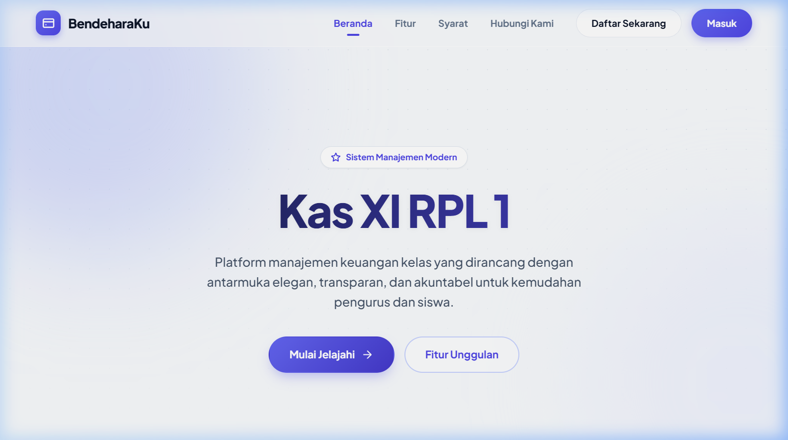
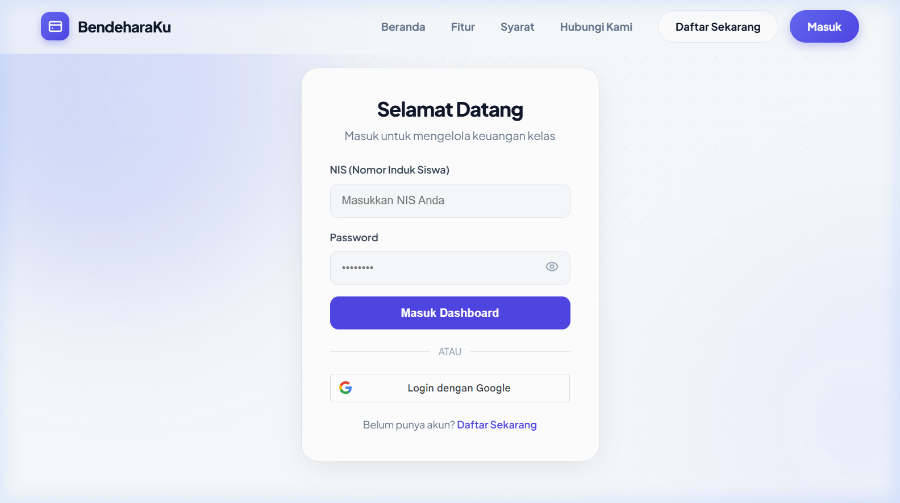

# BendeharaKu — Sistem Manajemen Keuangan Kelas


**BendeharaKu** adalah aplikasi manajemen keuangan kelas berbasis web dengan desain premium modern. Dibangun menggunakan pola arsitektur **Model-View-Controller (MVC)**, aplikasi ini membantu bendahara kelas mencatat iuran, pemasukan, dan pengeluaran secara transparan, akuntabel, dan sistematis — lengkap dengan dukungan **Google Sign-In**.

---

## 🖼️ Preview Antarmuka

<table>
  <tr>
    <td width="50%" align="center">
      
      <br><sub><b>Landing Page</b></sub>
    </td>
    <td width="50%" align="center">
      
      <br><sub><b>Halaman Login</b></sub>
    </td>
  </tr>
</table>

---

## 📌 Deskripsi Project

BendeharaKu memisahkan logika bisnis, antarmuka pengguna, dan akses database demi kode yang bersih dan mudah dikembangkan.

- **Transparansi:** Seluruh anggota dapat melihat rekapitulasi keuangan secara real-time.
- **Manajemen Data:** Kelola data siswa, riwayat iuran mingguan, pemasukan, dan pengeluaran.
- **Keamanan:** Autentikasi berbasis sesi + Google OAuth untuk akses yang aman.
- **Responsif:** Desain mobile-first dengan floating action buttons dan card-based layout di HP.

---

## 🛠️ Tech Stack

| Layer        | Teknologi                                            |
| ------------ | ---------------------------------------------------- |
| Language     | PHP Native                                           |
| Architecture | MVC (Model-View-Controller)                          |
| Database     | MySQL                                                |
| Frontend     | HTML5, Vanilla CSS3, JavaScript (ES6)                |
| Auth         | Session-based + Google Identity Services (OAuth 2.0) |
| Server       | Apache (XAMPP / Laragon)                             |
| Export       | PHP → Google Spreadsheet (CSV/Excel)                 |

---

## 🚀 Fitur Utama

### 🔐 Autentikasi & Otorisasi

- **Login & Register** — Sistem masuk dengan NIS + password.
- **Google Sign-In** — Login cepat menggunakan akun Google (OAuth 2.0).
- **Role-based Access** — Admin dan siswa memiliki akses fitur yang berbeda.

### 📊 Dashboard

- Ringkasan total saldo, total pemasukan, total pengeluaran.
- Grafik statistik transaksi bulanan.
- Informasi pembayaran iuran terbaru.

### 👥 Manajemen Siswa (Admin)

- CRUD data siswa (nama, NIS, nomor HP).
- Pencarian siswa berdasarkan nama atau NIS.
- Floating action button untuk tambah data di mobile.

### 💰 Pemasukan & Pengeluaran

- Catat dan kelola data pemasukan dari berbagai sumber.
- Catat pengeluaran beserta bukti foto/dokumen.
- Filter berdasarkan tahun.
- Ekspor ke Spreadsheet (Excel).

### 📋 Laporan Kas

- Rekapitulasi pembayaran iuran mingguan per siswa per bulan.
- Filter berdasarkan bulan dan status pembayaran.
- Ekspor laporan ke Spreadsheet.
- Admin dapat mengedit/hapus data langsung dari tabel.

### 👤 Profil Pengguna

- Lihat dan edit data profil (nama, email, foto profil).
- Update nomor kontak.

---

## 📁 Struktur Folder

```text
bendeharaKu/
├── app/
│   ├── Controllers/        # Logika aplikasi (AuthController)
│   ├── Models/             # Koneksi database (Database.php)
│   └── Views/
│       ├── admin/          # Halaman khusus admin (add/edit)
│       ├── partials/       # Header, Footer, Warning modal
│       ├── dashboard.php
│       ├── income.php
│       ├── expenses.php
│       ├── report.php
│       ├── students.php
│       ├── profile.php
│       ├── login.php
│       └── register.php
├── config/                 # Konfigurasi database
├── public/
│   ├── index.php           # Router utama + Landing Page
│   ├── assets/css/         # File CSS global (base.css)
│   └── images/             # Logo dan aset gambar
├── export_report.php       # Handler ekspor ke Spreadsheet
├── update_contact.php      # Handler update kontak
├── db_bendehara.sql        # Dump database MySQL
└── README.md
```

---

## ⚙️ Instalasi & Setup

### 1. Clone Repository

```bash
git clone https://github.com/Raditt10/bendeharaKu.git
cd bendeharaKu
```

### 2. Pindahkan ke Server Lokal

Pindahkan folder project ke `htdocs` (XAMPP) atau `www` (Laragon).

### 3. Setup Database

- Buka **phpMyAdmin**.
- Buat database baru bernama `db_bendehara`.
- Import file `db_bendehara.sql` dari root folder.

### 4. Konfigurasi Koneksi

Edit file `config/config.php`:

```php
define('DB_HOST', 'localhost');
define('DB_USER', 'root');
define('DB_PASS', '');
define('DB_NAME', 'db_bendehara');
```

### 5. Konfigurasi Google OAuth (Opsional)

Ganti `data-client_id` di `app/Views/login.php` dengan Client ID Google OAuth milik Anda dari [Google Cloud Console](https://console.cloud.google.com/).

### 6. Jalankan Aplikasi

Buka browser dan akses:

```
http://localhost/bendeharaKu/public/
```

---

## 🤝 Kontribusi

Aplikasi ini bersifat open-source.

1. Fork repository ini.
2. Buat branch fitur (`git checkout -b fitur-baru`).
3. Commit perubahan (`git commit -m 'Tambah fitur X'`).
4. Push ke branch (`git push origin fitur-baru`).
5. Buat Pull Request.

---

## 📄 Lisensi

Project ini dilisensikan di bawah **MIT License**.

---

_© 2026 BendeharaKu — Hak cipta milik pengembang [Raditt10](https://github.com/Raditt10)._
